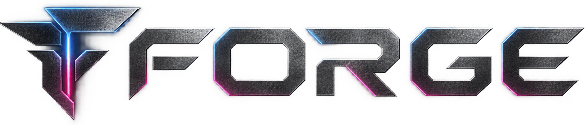

<p align="center">
  
</p>

<h1 align="center">Rhino Forge</h1>

<p align="center"><strong>Wavetables, samples, motion, and modulation—forged into one instrument.</strong></p>

<p align="center">
  <a href="#build-forge-on-windows">Build Forge</a> ·
  <a href="../../README.md">Rhino DAW</a> ·
  <a href="../../wiki/pages/forge.md">Forge wiki</a>
</p>

> [!IMPORTANT]
> Rhino Forge is in **mid-alpha**. It currently ships as a source-built Windows VST3 and standalone app. Installers for Windows and macOS are planned with Rhino's first production release, targeted for **December 2026–January 2027**.

Rhino Forge is a polyphonic wavetable and spectral synthesizer built for movement. Three oscillators, a playable noise engine, deep per-voice modulation, flexible mixing, and three effects racks live in one resizable instrument with a fast, direct workflow.

Forge is an independent JUCE plugin. Use it inside Rhino or another VST3 host, or open the standalone app when you want to design sounds without a DAW.

## Start with a waveform. End somewhere new.

### Three oscillators, two ways to create

Each oscillator can run as a band-limited wavetable instrument or resynthesize a sample in spectral mode. Draw and import wavetables, scan through frames, stack unison voices, tune each source independently, and chain two warp stages for shapes that move far beyond the original material.

Spectral mode separates pitch from time: play a loaded sample chromatically while scanning, freezing, reversing, or looping through its spectrum.

### Modulation that stays playable

Four envelopes, six LFOs, eight macros, velocity, key tracking, aftertouch, and performance controls route through an eight-slot modulation matrix. Drag a source onto a control, set the depth, and keep working; visual feedback follows the same values the audio engine uses.

### A filter built for character

Thirty-four filter types cover state-variable shapes, dual filters, morphing responses, analogue ladders, resonators, combs, vowels, ring modulation, sample-and-hold, and diffusion. The response display is calculated from the same filter code that processes the sound.

### Route, mix, and finish inside the patch

The mixer gives the sub, three oscillators, noise, and filter their own level, pan, routing, and sends. Two effect buses and the main output each carry an ordered eight-slot rack with reverb, delay, chorus, distortion, EQ, filter, compression, and phaser.

### Play patterns, not just notes

Forge's arpeggiator turns held chords into musical motion with multiple directions, scale-aware intervals, swing, gate, repeats, retriggering, octave movement, and launch quantization. MIDI learn maps hardware knobs and pads directly to the panel.

## Use Forge three ways

| Format | Best for | Output |
| --- | --- | --- |
| Standalone | Sound design and playing without a DAW | `Standalone/Rhino Forge.exe` |
| VST3 | Any compatible Windows host | `VST3/Rhino Forge.vst3` |
| Inside Rhino | A native part of the Rhino writing workflow | Discovered from the development build automatically |

## What to expect from the alpha

The core synth, wavetable editor, spectral oscillator, modulation, mixer, effects racks, arpeggiator, presets, MIDI learn, and host automation are working and covered by focused DSP and UI tests.

The factory preset library is still small, parts of the spectral workflow remain under construction, and a custom arpeggiator pattern editor and sample-based noise sources are not yet available. Preset compatibility may change before the production release.

## Build Forge on Windows

Forge uses Rhino's pinned JUCE checkout, so setup begins at the repository root.

### 1. Install the prerequisites

- [Git](https://git-scm.com/download/win) and [Git LFS](https://git-lfs.com/)
- [Python 3.12 or newer](https://www.python.org/downloads/windows/)
- [CMake 3.24 or newer](https://cmake.org/download/)
- [Visual Studio 2022](https://visualstudio.microsoft.com/vs/) with **Desktop development with C++** and a Windows SDK

### 2. Clone and build

Open PowerShell and run:

```powershell
git lfs install
git clone https://github.com/monkjuice/Rhino.git
Set-Location Rhino
python native/scripts/fetch-dependencies.py
cmake -S instruments/rhino-forge -B instruments/rhino-forge/build -G "Visual Studio 17 2022" -A x64
cmake --build instruments/rhino-forge/build --config Release --parallel 2 -- /p:BuildInParallel=false
```

`BuildInParallel=false` avoids a Visual Studio project-resolution failure while compilation still uses two jobs.

### 3. Run the standalone app

```powershell
& ".\instruments\rhino-forge\build\RhinoForge_artefacts\Release\Standalone\Rhino Forge.exe"
```

To play from a MIDI controller, open **Options → Audio/MIDI Settings** and enable the input once. A plugin host handles MIDI routing for the VST3.

### 4. Use the VST3

The plugin bundle is built at:

```text
instruments/rhino-forge/build/RhinoForge_artefacts/Release/VST3/Rhino Forge.vst3
```

Rhino finds this development bundle automatically. For another host, add its parent folder to the host's VST3 search paths or install the bundle in the standard system VST3 location after testing it.

## Verify a development build

Build and run all Forge test areas:

```powershell
cmake --build instruments/rhino-forge/build --config Release --target RhinoForgeTests --parallel 2 -- /p:BuildInParallel=false
ctest --test-dir instruments/rhino-forge/build -C Release -j 8 --output-on-failure
```

Run one area while iterating—for example, the effects rack:

```powershell
ctest --test-dir instruments/rhino-forge/build -C Release -R forge_fx --output-on-failure
```

The full architecture, DSP decisions, module behavior, test tools, and build gotchas live in the [Forge wiki](../../wiki/pages/forge.md). Useful starting points include the [engine](../../wiki/pages/forge-engine.md), [oscillators](../../wiki/pages/forge-oscillators.md), [modulation](../../wiki/pages/forge-modulation.md), [effects](../../wiki/pages/forge-mixer-and-fx.md), and [build guide](../../wiki/pages/build-and-test-forge.md).
